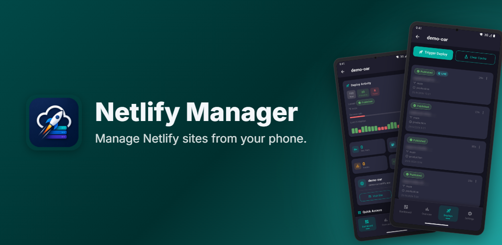
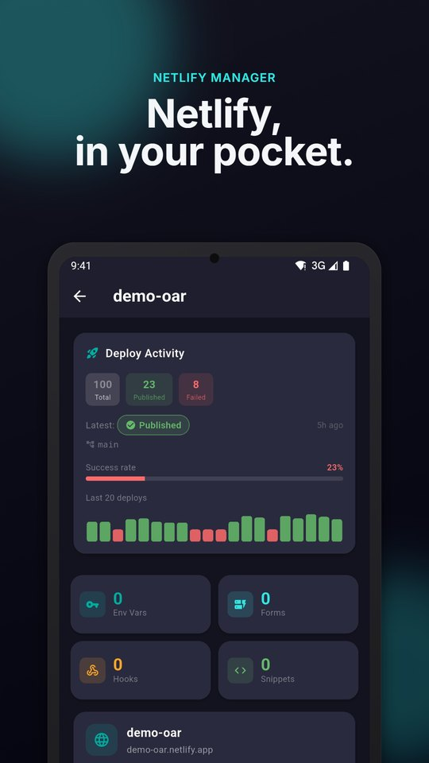
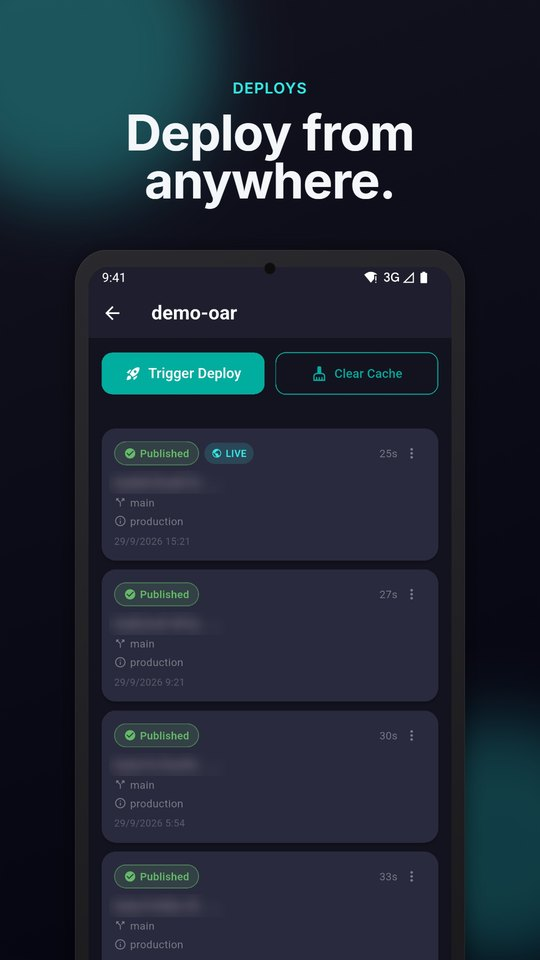
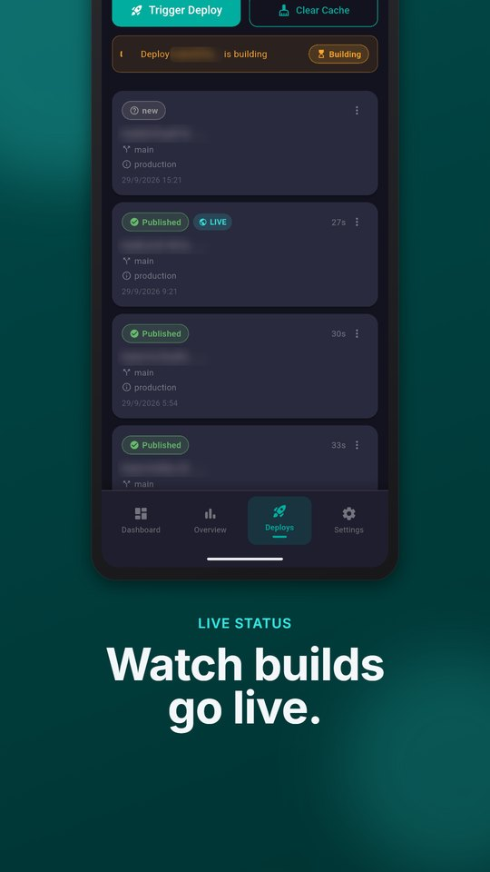
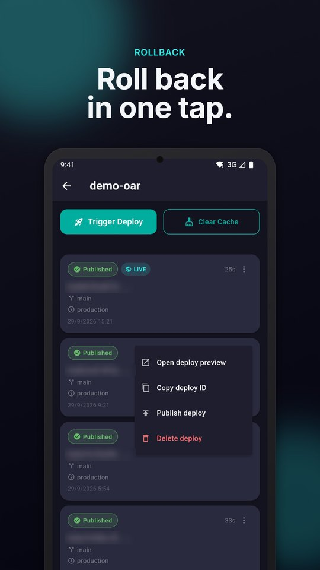
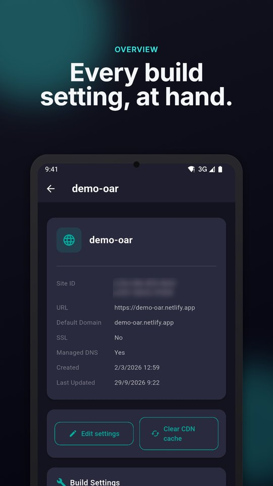
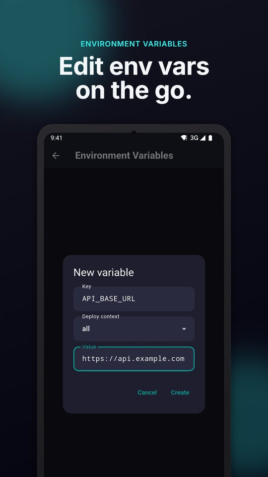
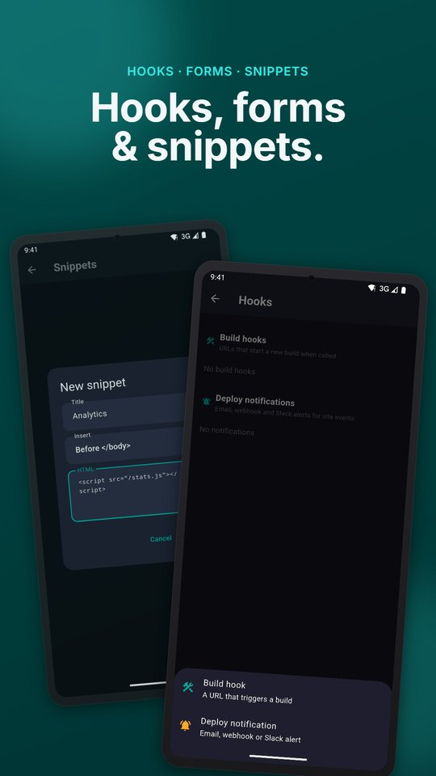
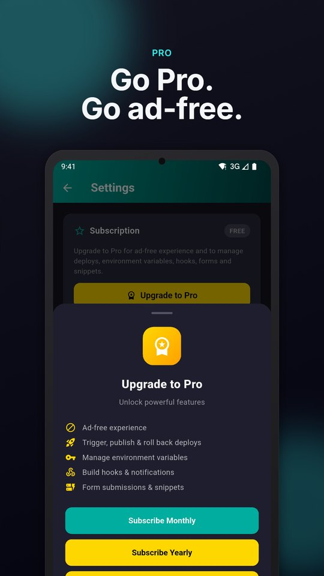

  

<h1 align="center">Netlify Manager – Netlify client for Android</h1>

  Manage your Netlify sites, deploys and environment variables from your phone.

  <a href="https://play.google.com/store/apps/details?id=com.oradevs.netlify_manager"><b>Get it on Google Play</b></a>
  ·
  <a href="https://github.com/oradevs/netlify-manager/issues/new/choose">Report a bug</a>
  ·
  <a href="https://github.com/oradevs/netlify-manager/issues/new/choose">Request a feature</a>
  ·
  <a href="https://oradevs.com/">Website</a>

  

**Netlify Manager** is an Android app for developers, DevOps engineers and agencies who host sites on Netlify.
Trigger a deploy, roll back a bad release, edit an environment variable or check a build status without opening a laptop.
It talks directly to the Netlify REST API using your own Personal Access Token.

> Netlify Manager is a third-party app made by [OraDevs](https://github.com/oradevs). It is not affiliated with or endorsed by Netlify, Inc.

This repository is the public home for **feedback, bug reports and feature requests**. The app's source code is not published here.

## Screenshots

  
  
  
  

  
  
  
  

## Features

### Sites
- All your Netlify sites in one list, with HTTPS status
- Site dashboard: deploy totals, success rate and the last 20 deploys at a glance
- Overview: domain, managed DNS, repository, branch, build command, publish directory and build image
- Edit the site name, build command and publish directory
- Clear the CDN cache

### Deploys
- Full deploy history with Published, Building and Failed badges
- Trigger a deploy, or clear the build cache and deploy
- Live status while a deploy is building
- Publish any earlier deploy to roll back
- Cancel a running deploy, lock or unlock auto publishing, delete a deploy
- Open the deploy preview or copy the deploy ID

### Environment variables
- List variables for a site
- Add a variable and set its value per deploy context
- Copy keys and values, delete variables

### Forms, hooks and snippets
- Netlify Forms and their submissions
- Build hooks (URLs that start a new build)
- Deploy notifications by email, webhook or Slack
- Snippet injection: add a script to every page

### Security
- Sign in with a Netlify Personal Access Token; no password is ever requested
- The token is kept in encrypted storage on your device and is masked in the app
- Requests go straight from your phone to `api.netlify.com` over HTTPS; there is no OraDevs server in between
- A rate-limit warning appears when your Netlify API quota runs low

## Free and Pro

| | Free | Pro |
|---|:---:|:---:|
| Browse sites, deploy history and site details | ✅ | ✅ |
| Trigger, publish and roll back deploys | – | ✅ |
| Manage environment variables | – | ✅ |
| Build hooks and notifications | – | ✅ |
| Form submissions and snippets | – | ✅ |
| Ads | Shown | Removed |

Pro is available as a monthly or yearly subscription, or a one-time lifetime purchase, through Google Play.

## Getting started

1. Install [Netlify Manager from Google Play](https://play.google.com/store/apps/details?id=com.oradevs.netlify_manager).
2. In Netlify, open **User settings → Applications → Personal access tokens** (`app.netlify.com/user/applications#personal-access-tokens`) and create a token.
3. Paste the token into the app and tap **Connect to Netlify**.

Want to look around first? Tap **Demo Login** on the sign-in screen to explore the app with a demo account.

## FAQ

**Is this the official Netlify app?**
No. Netlify Manager is an independent, third-party client built on the public Netlify API.

**Where is my token stored?**
Only on your device, in encrypted storage. It is sent only to Netlify's API. You can remove it at any time with **Logout** in Settings, and revoke it from your Netlify account.

**Does the app collect data?**
The app has no backend of its own and does not upload your sites or token to us. It does include ad and analytics SDKs (Google AdMob, Meta Audience Network, Firebase Analytics). See the [privacy policy](https://policies.oradevs.com/netlify/privacy-policy.html) for details.

**Can I deploy by uploading a ZIP?**
Not at the moment.

**Can I read build logs?**
Not yet. If you need it, please upvote or open a feature request.

**Is there an iOS version?**
The app is currently Android only.

## Feedback and support

Your reports decide what gets built next.

- 🐞 **Found a bug?** [Open a bug report](https://github.com/oradevs/netlify-manager/issues/new?template=bug_report.yml)
- 💡 **Missing something?** [Open a feature request](https://github.com/oradevs/netlify-manager/issues/new?template=feature_request.yml), or add a 👍 to an existing one
- ⭐ **Enjoying the app?** [Leave a review on Google Play](https://play.google.com/store/apps/details?id=com.oradevs.netlify_manager) and star this repository

Please never paste a Personal Access Token, build hook URL or environment variable value into an issue.

## Changelog

See [CHANGELOG.md](CHANGELOG.md).

## Privacy

See the [privacy policy](https://policies.oradevs.com/netlify/privacy-policy.html).

---

Netlify is a trademark of Netlify, Inc. Netlify Manager is an independent product by OraDevs and is not affiliated with Netlify, Inc.
